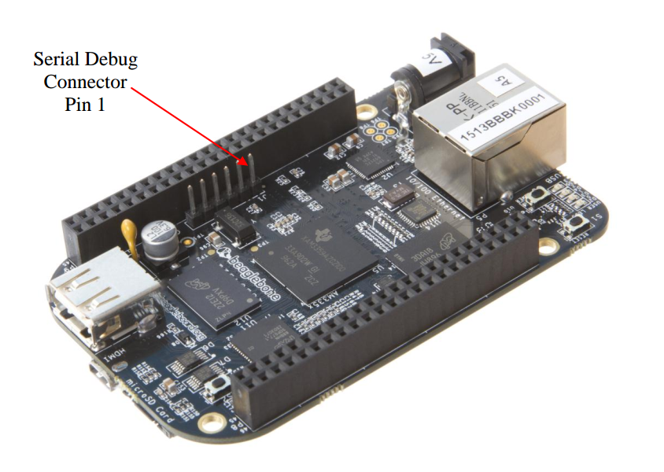

title: OpenEmbedded/Yocto
description: Lab history for the Yocto Project and OpenEmbedded Training offered by Bootlin
hero: Yocto Project and OpenEmbedded Training

*These are the notes and commands to solve the yocto training offered by Bootlin
company.*

## Training Setup

```shell
cd yocto-labs/poky
git checkout sumo-19.0.0-yocto-labs
```

!!! Note
	You will find [yocto-labs](https://github.com/dagmcr/yocto-labs) repository as a submodule of the [training-materials](https://github.com/dagmcr/training-materials) project.

	```shell
	git clone git@github.com:dagmcr/training-materials.git
	cd training-materials
	git submodule init
	git submodule update
	cd yocto-labs
	```

### Set up the build environment

This yocto lab is going to use [docker](https://docs.docker.com/install/) for 
doing the practical labs. You can use your computer instead as it is in the 
original Bootlin training.

```shell
sudo apt-get install docker.io
```

Build poky-container:

```shell
cd training-materials/yocto-labs/docker
sh build.sh
```

This will create a local docker image with the required content for the lab.

```shell
docker images | grep poky
crops/poky          debian-9            c65a9a0df5a9        2 weeks ago         844MB
```

You can now, enter in the poky container by executing:

```shell
cd training-materials/yocto-labs/
sh start-poky-container.sh
```

!!! info
	[crops/poky](https://hub.docker.com/r/crops/poky) is the poky container 
	used for the labs. To enter in the container the command would be:

	`start-poky-container.sh`:

	```shell
	docker run --rm -it -v $PWD:/workdir crops/poky:debian-9 \
	--workdir=/workdir
	```

## yocto setup 

!!! Note
	You will find [poky](https://github.com/dagmcr/poky) and [meta-ti](https://github.com/dagmcr/meta-ti) repositories as submodules of the [yocto-labs](https://github.com/dagmcr/yocto-labs) project. Submodules are located under the `yocto/` folder.

	```shell
	cd training-materials/yocto-labs
	git submodule init
	git submodule update
	```

!!! info
	Remember to check `poky` and `meta-ti` repos are pointing respectively to the `sumo-19.0.0` `sumo-ti2018.02c-yocto-labs`.

	*  `meta-ti` bootlin patches already applied:

	```shell
	01eb7040 2018-07-25 (HEAD -> sumo-ti2018.02c-yocto-labs, origin/sumo-ti2018.02c-yocto-labs) fix bitbake warnings [Quentin Schulz]
	8ebeeae9 2018-07-25 recipes-bsp/u-boot: fix non-booting U-Boot [Quentin Schulz]
	0f0c19b6 2018-07-25 do not use base_read_file [Quentin Schulz]
	7e9fb95d 2018-07-24 Simplify linux-ti-staging recipe [Quentin Schulz]
	```

	*  `poky` bootlin patches already applied:

	```shell
	89be888da6 2019-04-11 (HEAD -> sumo-19.0.0-yocto-labs, origin/sumo-19.0.0-yocto-labs) bblayers: do not include meta-yocto-bsp [Antoine Tenart]
	```

Now, you can start creating the yocto build directory by executing:

```shell
cd training-materials/yocto-labs
sh start-poky-container.sh
/workdir$ cd yocto/
/workdir/yocto$ source poky/oe-init-build-env
```

!!! Note
	`/workdir/yocto$` means we are 'inside' the docker poky container.

Now we should verify that `meta-ti` layer is already in `bblayers.conf` file:

```shell
cat build/conf/bblayers.conf
...
BBLAYERS ?= " \
  /workdir/yocto/poky/meta \
  /workdir/yocto/poky/meta-poky \
  /workdir/yocto/meta-ti \
  "
```

### Build your first image

In this case we are going to select `beaglebone` as our target `'MACHINE'`. You
can specify it under the `build/conf/local.conf` or provide it as a variable
in the bitbake command:

```shell
/workdir/yocto/build$ MACHINE=beaglebone bitbake core-image-minimal
```

Now, you can go and drink a :beer:. Maybe :beer: :beer:. If you still remember 
to come back after a while, you can check the output:

```shell
ls -l yocto-labs/yocto/build/tmp/deploy/images/beaglebone/
```

### Setup SD card

Plug your microSD card :floppy_disk: in your machine and check which device is created. In my
case SD card is: `/dev/sde`. Unmount and format it:

```shell
cd yocto-labs/bootlin-lab-data/script/
sudo umount /dev/sde1
sudo umount /dev/sde2
sudo ./format_sdcard.sh /dev/sde
```

Remove the SD card and insert it again to copy all the BSP and rootfs:

```shell
cp yocto-labs/yocto/build/tmp/deploy/images/beaglebone/{MLO,u-boot.img,zImage} \
/media/$USER/boot

cp yocto-labs/yocto/build/tmp/deploy/images/beaglebone/zImage-am335x-boneblack-wireless.dtb \
/media/$USER/boot/dtb

sudo tar xpf yocto-labs/yocto/build/tmp/deploy/images/beaglebone/\
core-image-minimal-beaglebone.tar.xz -C /media/$USER/rootfs

sync
```

## Setting up serial communication with the board

`picocom`, why not? Others might prefer (gtk-term)[http://gtkterm.feige.net/]. I
would go with the first one as it is the one used in the training.

```shell
sudo apt install picocom
sudo adduser $USER dialout
```

Log out and log in. 

> Yeap... 

Now, we can connect the UART to see the logs of the board. In this case, my 
usb serial is located in `/dev/ttyUSB0`.

```shell
picocom -b 115200 /dev/ttyUSB0
```

| PIN BBB | Connector USB-Serial | Color | Connector BBB |
|---------|----------------------|-------|---------------|
| 1       | GND                  | Blue  | GND           |
| 4       | TX                   | Red   | RX            |
| 5       | RX                   | Green | TX            |



!!! info
	If you wish to exit picocom, press `[Ctrl][a]` followed by
	`[Ctrl][x]`.

### Configure the U-Boot environment and boot

In our U-Boot environment, we would need to type save `bootcmd` command which
would be used for the booting process:

```
setenv bootcmd 'mmc rescan; fatload mmc 0 0x80200000 zImage; fatload mmc 0 0x82000000 dtb; bootz 0x80200000 - 0x82000000'
setenv bootargs 'console=ttyS0,115200 root=/dev/mmcblk0p2 rootwait rw'
saveenv
boot
```

!!! info
	Remember how to boot properly from the SD card every time you reboot
	the board by pressing `'S2'` button when starting.

If everything went ok, we should have seen the kernel booting and the new login prompt:

```shell
=> boot
reading zImage
3998208 bytes read in 252 ms (15.1 MiB/s)
reading dtb
38058 bytes read in 6 ms (6 MiB/s)
## Flattened Device Tree blob at 82000000
   Booting using the fdt blob at 0x82000000
   Loading Device Tree to 8fff3000, end 8ffff4a9 ... OK

Starting kernel ...

[    0.000000] Booting Linux on physical CPU 0x0
[    0.000000] Linux version 4.14.54-g0b59bc3be7 (oe-user@oe-host) (gcc version 7.3.0 (GCC)) #1 PREEMPT Mon Sep 2 21:54:59 UTC 2019
[    0.000000] CPU: ARMv7 Processor [413fc082] revision 2 (ARMv7), cr=10c5387d
[    0.000000] CPU: PIPT / VIPT nonaliasing data cache, VIPT aliasing instruction cache
...

beaglebone login: 
```


## Lab 2: Advanced Yocto configuration

### Set up the Ethernet communication and NFS on the board

```
setenv ipaddr 192.168.5.100
setenv serverip 192.168.5.1
setenv ethact usb_ether
setenv usbnet_devaddr f8:dc:7a:00:00:02
setenv usbnet_hostaddr f8:dc:7a:00:00:01
saveenv
```

!!! info

	Bootlin: *Make sure that this address belongs to a separate network segment from the one used by your PC to connect to the network.*

#### Test TFTP server

```shell
sudo apt install tftpd-hpa
```

Configuration in `/etc/default/tftpd-hpa`: `TFTP_DIRECTORY="/srv/tftp"`

```shell
sudo mkdir -p /srv/tftp
sudo chown -R $USER.$USER /srv/tftp
sudo chmod 755 -R /srv/tftp
touch /srv/tftp/textfile.txt
echo "hello world" > /srv/tftp/textfile.txt
```

```
tftp 0x81000000 textfile.txt
md 0x81000000
```

!!! note

	If you need to restart the service:

	```shell
	sudo service tftpd-hpa restart
	```

##### Set up the Ethernet communication on the workstation

```shell
nmcli con add type ethernet ifname enxf8dc7a000001 ip4 192.168.5.1/24
```

!!! tip 
	Extra options (modify/delete):

	```shell
	nmcli con modify ethernet-enxf8dc7a000001 ip4 192.168.5.1/24
	nmcli con del ethernet-enxf8dc7a000001
	```

!!! warning
	When booting rootfs from NFS, check if usb-eth device registers a
	different random name.

	Check NFS logs:

	```shell
	[    1.663572] using random self ethernet address
	[    1.668049] using random host ethernet address
	[    1.672515] using host ethernet address: f8:dc:7a:00:00:01
	[    1.672520] using self ethernet address: f8:dc:7a:00:00:02
	[    1.678723] usb0: HOST MAC f8:dc:7a:00:00:01
	[    1.688646] usb0: MAC f8:dc:7a:00:00:02
	[    1.692520] using random self ethernet address
	[    1.697007] using random host ethernet address
	[    1.701535] g_ether gadget: Ethernet Gadget, version: Memorial Day 2008
	[    1.708244] g_ether gadget: g_ether ready
	```

	Host:

	```shell
	[12798.983385] cdc_eem 1-12:1.0 enp0s20f0u12: renamed from usb0
	```

In my case, device was renamed to `enp0s20f0u12`. So, I proceed as follows:

Check new eth-usb interface:

```shell
sudo ifconfig enp0s20f0u12
```

Configure it:

```shell
nmcli con add type ethernet ifname enp0s20f0u12 ip4 192.168.5.1/24
nmcli con modify ethernet-enp0s20f0u12 ip4 192.168.5.1/24
```

### Set up the NFS server on the workstation

```shell
sudo apt install nfs-kernel-server
sudo mkdir -m 777 /srv/nfs
```

Append `/srv/nfs` to `/etc/exports`:
```shell
/nfs 192.168.5.100(rw,no_root_squash,no_subtree_check)
```

```shell
sudo service nfs-kernel-server restart
```

!!! note
	You can also restart the service by executing:

	```shell
	sudo /etc/init.d/nfs-kernel-server restart
	```

Check NFS server:

```shell
sudo showmount -e localhost
Export list for localhost:
/srv/nfs 192.168.5.100
```

!!! info
	If `showmount` is not available, try to install it through `nfs-common`
	package.

Now, we can verify if it is up and running...

```shell
sudo mkdir -p /mnt/nfs
sudo mount -t nfs localhost:/srv/nfs /mnt/nfs
```

### Add a package to the rootfs image

Append `dropbear` :bear: package to the `build/conf/local.conf`:

```
IMAGE_INSTALL_append = " dropbear"
```
### Regenerate image

```shell
MACHINE=beaglebone bitbake core-image-minimal
```

```
sudo tar xpf yocto-labs/yocto/build/tmp/deploy/images/beaglebone/\
core-image-minimal-beaglebone.tar.xz -C /srv/nfs
```

### Set up bootargs and boot rootfs over NFS

```
setenv bootargs 'console=ttyS0,115200 root=/dev/nfs rw nfsroot=192.168.5.1:/srv/nfs,nfsvers=3
ip=192.168.5.100:::::usb0 g_ether.dev_addr=f8:dc:7a:00:00:02
g_ether.host_addr=f8:dc:7a:00:00:01'
saveenv
```

bootargs tested:
```
setenv bootargs root=/dev/nfs rw ip=192.168.5.100:::::usb0 console=ttyO0,115200n8 g_ether.dev_addr=f8:dc:7a:00:00:02 g_ether.host_addr=f8:dc:7a:00:00:01 nfsroot=192.168.5.1:/nfs,nfsvers=3
```

!!! info
	Check this step by step [guide](https://bootlin.com/blog/tftp-nfs-booting-beagle-bone-black-wireless-pocket-beagle/) if somehow you can't configure tftp properly.

!!! warning
	Check random self ethernet address log and reconfigure the new eth device in your host:

	```shell
	[    1.663572] using random self ethernet address
	[    1.668049] using random host ethernet address
	[    1.672515] using host ethernet address: f8:dc:7a:00:00:01
	[    1.672520] using self ethernet address: f8:dc:7a:00:00:02
	[    1.678723] usb0: HOST MAC f8:dc:7a:00:00:01
	[    1.688646] usb0: MAC f8:dc:7a:00:00:02
	[    1.692520] using random self ethernet address
	[    1.697007] using random host ethernet address
	[    1.701535] g_ether gadget: Ethernet Gadget, version: Memorial Day 2008
	[    1.708244] g_ether gadget: g_ether ready
	[    1.721482] hctosys: unable to open rtc device (rtc0)
	[    1.727483] IPv6: ADDRCONF(NETDEV_UP): usb0: link is not ready
	[    2.191455] g_ether gadget: high-speed config #1: CDC Ethernet (EEM)
	[    2.212972] IPv6: ADDRCONF(NETDEV_CHANGE): usb0: link becomes ready
	[    2.243045] IP-Config: Guessing netmask 255.255.255.0
	[    2.248132] IP-Config: Complete:
	[    2.251383]      device=usb0, hwaddr=f8:dc:7a:00:00:02, ipaddr=192.168.5.100, mask=255.255.255.0, gw=255.255.255.255
	[    2.262455]      host=192.168.5.100, domain=, nis-domain=(none)
	[    2.268666]      bootserver=255.255.255.255, rootserver=192.168.5.1, rootpath=
	```

	> Target

	```shell
	[12798.983385] cdc_eem 1-12:1.0 enp0s20f0u2: renamed from usb0
	```

	> Host

	Then, in your host check:

	```shell
	sudo ifconfig enp0s20f0u2
	```

	And then, add/modify the interface configuration:

	```shell
	nmcli con add type ethernet ifname enp0s20f0u2 ip4 192.168.5.1/24
	nmcli con modify ethernet-enp0s20f0u2 ip4 192.168.5.1/24
	```

	If needed, reboot it the board once the interface is already configured.


### Check dropbear

Try to connect to the board over ssh and then, we will verify `dropbear` package
is running properly:

```shell
ssh root@192.168.5.100
```

### Choose a package variant

Check kernel used:

```shell
bitbake -vn virtual/kernel
```

Output:

```shell
...
NOTE: selecting linux-yocto to satisfy runtime kernel-base due to PREFERRED_PROVIDER_virtual/kernel = linux-yocto
...
```

### Tips

*  Useful commands:

```shell
bitbake -c listtasks virtual/kernel
bitbake -c <task> virtual/kernel
bitbake -f virtual/kernel
bitbake --runall=fetch world

# You can get a list of locally available packages and their current version with
bitbake -s

bitbake -h
```

*  https://layers.openembedded.org/rrs/recipes/OE-Core/2.8/M3/

### Going further

Setup tftp to be able to load kernel and dtb through TFTP server:

```shell
cp yocto-labs/yocto/build/tmp/deploy/images/beaglebone/zImage /srv/tftp

cp yocto-labs/yocto/build/tmp/deploy/images/beaglebone/zImage-am335x-boneblack-wireless.dtb \
/srv/tftp/dtb
```

```
setenv bootcmd 'tftp 0x81000000 zImage; tftp 0x82000000 dtb; bootz 0x81000000 - 0x82000000'
saveenv
boot
```

Output:

```shell
U-Boot 2018.01-gefdd6cd5ab (Aug 19 2019 - 20:51:06 +0000)

CPU  : AM335X-GP rev 2.1
I2C:   ready
DRAM:  512 MiB
No match for driver 'omap_hsmmc'
No match for driver 'omap_hsmmc'
Some drivers were not found
MMC:   OMAP SD/MMC: 0, OMAP SD/MMC: 1
Net:   cpsw, usb_ether
Press SPACE to abort autoboot in 2 seconds
=> setenv bootcmd 'tftp 0x81000000 zImage; tftp 0x82000000 dtb; bootz 0x81000000 - 0x82000000'
=> saveenv
Saving Environment to MMC...
Writing to redundant MMC(1)... done
=> boot
cpsw Waiting for PHY auto negotiation to complete......... TIMEOUT !
using musb-hdrc, OUT ep1out IN ep1in STATUS ep2in
MAC f8:dc:7a:00:00:02
HOST MAC f8:dc:7a:00:00:01
RNDIS ready
musb-hdrc: peripheral reset irq lost!
high speed config #2: 2 mA, Ethernet Gadget, using RNDIS
USB RNDIS network up!
Using usb_ether device
TFTP from server 192.168.5.1; our IP address is 192.168.5.100
Filename 'zImage'.
Load address: 0x81000000
Loading: #################################################################
	 #################################################################
	 #################################################################
	 #################################################################
	 #############
	 4.3 MiB/s
done
Bytes transferred = 3998208 (3d0200 hex)
using musb-hdrc, OUT ep1out IN ep1in STATUS ep2in
MAC f8:dc:7a:00:00:02
HOST MAC f8:dc:7a:00:00:01
RNDIS ready
high speed config #2: 2 mA, Ethernet Gadget, using RNDIS
USB RNDIS network up!
Using usb_ether device
TFTP from server 192.168.5.1; our IP address is 192.168.5.100
Filename 'dtb'.
Load address: 0x82000000
Loading: ###
	 3.6 MiB/s
done
Bytes transferred = 38058 (94aa hex)
## Flattened Device Tree blob at 82000000
   Booting using the fdt blob at 0x82000000
   Loading Device Tree to 8fff3000, end 8ffff4a9 ... OK

Starting kernel ...

[    0.000000] Booting Linux on physical CPU 0x0
[    0.000000] Linux version 4.14.54-g0b59bc3be7 (oe-user@oe-host) (gcc version 7.3.0 (GCC)) #1 PREEMPT Mon Sep 2 21:54:59 UTC 2019
[    0.000000] CPU: ARMv7 Processor [413fc082] revision 2 (ARMv7), cr=10c5387d
```

## Lab 3: Add a custom application


