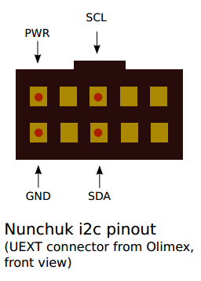
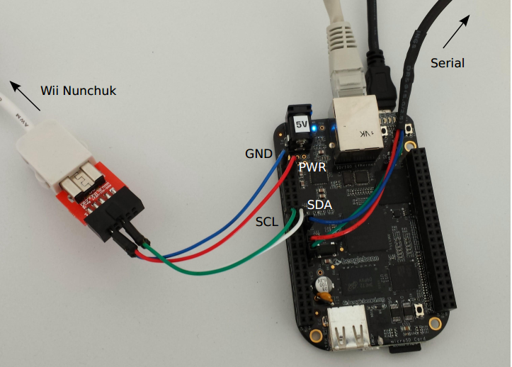

title: OpenEmbedded/Yocto
description: Lab history for the Yocto Project and OpenEmbedded Training offered by Bootlin
hero: Yocto Project and OpenEmbedded Training

*These are the notes and commands to solve the yocto training offered by Bootlin
company.*

## Training Setup

```shell
cd yocto-labs/poky
git checkout sumo-19.0.0-yocto-labs
```

!!! Note
	You will find [yocto-labs](https://github.com/dagmcr/yocto-labs) repository as a submodule of the [training-materials](https://github.com/dagmcr/training-materials) project.

	```shell
	git clone git@github.com:dagmcr/training-materials.git
	cd training-materials
	git submodule init
	git submodule update
	cd yocto-labs
	```

### Set up the build environment

This yocto lab is going to use [docker](https://docs.docker.com/install/) for
doing the practical labs. You can use your computer instead as it is in the
original Bootlin training.

```shell
sudo apt-get install docker.io
```

Build poky-container:

```shell
cd training-materials/yocto-labs/docker
sh build.sh
```

This will create a local docker image with the required content for the lab.

```shell
docker images | grep poky
crops/poky          debian-9            c65a9a0df5a9        2 weeks ago         844MB
```

You can now, enter in the poky container by executing:

```shell
cd training-materials/yocto-labs/
sh start-poky-container.sh
```

!!! info
	[crops/poky](https://hub.docker.com/r/crops/poky) is the poky container
	used for the labs. To enter in the container the command would be:

	`start-poky-container.sh`:

	```shell
	docker run --rm -it -v $PWD:/workdir crops/poky:debian-9 \
	--workdir=/workdir
	```

## Lab1: First Yocto Project build

### Extracted from the slides

Some highlights from the training slides:

*  `BB_NUMBER_THREADS`: *How many tasks BitBake should perform in parallel.
Defaults to the number of CPUs on the system.*
*  `PARALLEL_MAKE`: *How many processes should be used when compiling.
Defaults to the number of CPUs on the system.*
*  `MACHINE` **The machine the target is built for, e.g. beaglebone.**

### Yocto setup

!!! Note
	You will find [poky](https://github.com/dagmcr/poky) and [meta-ti](https://github.com/dagmcr/meta-ti) repositories as submodules of the [yocto-labs](https://github.com/dagmcr/yocto-labs) project. Submodules are located under the `yocto/` folder.

	```shell
	cd training-materials/yocto-labs
	git submodule init
	git submodule update
	```

!!! info
	Remember to check `poky` and `meta-ti` repos are pointing respectively to the `sumo-19.0.0` `sumo-ti2018.02c-yocto-labs`.

	*  `meta-ti` bootlin patches already applied:

	```shell
	01eb7040 2018-07-25 (HEAD -> sumo-ti2018.02c-yocto-labs, origin/sumo-ti2018.02c-yocto-labs) fix bitbake warnings [Quentin Schulz]
	8ebeeae9 2018-07-25 recipes-bsp/u-boot: fix non-booting U-Boot [Quentin Schulz]
	0f0c19b6 2018-07-25 do not use base_read_file [Quentin Schulz]
	7e9fb95d 2018-07-24 Simplify linux-ti-staging recipe [Quentin Schulz]
	```

	*  `poky` bootlin patches already applied:

	```shell
	89be888da6 2019-04-11 (HEAD -> sumo-19.0.0-yocto-labs, origin/sumo-19.0.0-yocto-labs) bblayers: do not include meta-yocto-bsp [Antoine Tenart]
	```

Now, you can start creating the yocto build directory by executing:

```shell
cd training-materials/yocto-labs
sh start-poky-container.sh
/workdir$ cd yocto/
/workdir/yocto$ source poky/oe-init-build-env
```

!!! Note
	`/workdir/yocto$` means we are 'inside' the docker poky container.

Now we should verify that `meta-ti` layer is already in `bblayers.conf` file:

```shell
cat build/conf/bblayers.conf
...
BBLAYERS ?= " \
  /workdir/yocto/poky/meta \
  /workdir/yocto/poky/meta-poky \
  /workdir/yocto/meta-ti \
  "
```

### Build your first image

In this case we are going to select `beaglebone` as our target `'MACHINE'`. You
can specify it under the `build/conf/local.conf` or provide it as a variable
in the bitbake command:

```shell
/workdir/yocto/build$ MACHINE=beaglebone bitbake core-image-minimal
```

Now, you can go and drink a :beer:. Maybe :beer: :beer:. If you still remember
to come back after a while, you can check the output:

```shell
ls -l yocto-labs/yocto/build/tmp/deploy/images/beaglebone/
```

### Setup SD card

Plug your microSD card :floppy_disk: in your machine and check which device is created. In my
case SD card is: `/dev/sde`. Unmount and format it:

```shell
cd yocto-labs/bootlin-lab-data/script/
sudo umount /dev/sde1
sudo umount /dev/sde2
sudo ./format_sdcard.sh /dev/sde
```

Remove the SD card and insert it again to copy all the BSP and rootfs:

```shell
cp yocto-labs/yocto/build/tmp/deploy/images/beaglebone/{MLO,u-boot.img,zImage} \
/media/$USER/boot

cp yocto-labs/yocto/build/tmp/deploy/images/beaglebone/zImage-am335x-boneblack-wireless.dtb \
/media/$USER/boot/dtb

sudo tar xpf yocto-labs/yocto/build/tmp/deploy/images/beaglebone/\
core-image-minimal-beaglebone.tar.xz -C /media/$USER/rootfs

sync
```

### Setting up serial communication with the board

`picocom`, why not? Others might prefer (gtk-term)[http://gtkterm.feige.net/]. I
would go with the first one as it is the one used in the training.

```shell
sudo apt install picocom
sudo adduser $USER dialout
```

Log out and log in.

> Yeap...

Now, we can connect the UART to see the logs of the board. In this case, my
usb serial is located in `/dev/ttyUSB0`.

```shell
picocom -b 115200 /dev/ttyUSB0
```

| PIN BBB | Connector USB-Serial | Color | Connector BBB |
|---------|----------------------|-------|---------------|
| 1       | GND                  | Blue  | GND           |
| 4       | TX                   | Red   | RX            |
| 5       | RX                   | Green | TX            |


!!! info
	If you wish to exit picocom, press `[Ctrl][a]` followed by
	`[Ctrl][x]`.

### Configure the U-Boot environment and boot

In our U-Boot environment, we would need to type save `bootcmd` command which
would be used for the booting process:

```
setenv bootcmd 'mmc rescan; fatload mmc 0 0x80200000 zImage; fatload mmc 0 0x82000000 dtb; bootz 0x80200000 - 0x82000000'
setenv bootargs 'console=ttyS0,115200 root=/dev/mmcblk0p2 rootwait rw'
saveenv
boot
```

!!! info
	Remember how to boot properly from the SD card every time you reboot
	the board by pressing `'S2'` button when starting.

If everything went ok, we should have seen the kernel booting and the new login prompt:

```shell
=> boot
reading zImage
3998208 bytes read in 252 ms (15.1 MiB/s)
reading dtb
38058 bytes read in 6 ms (6 MiB/s)
## Flattened Device Tree blob at 82000000
   Booting using the fdt blob at 0x82000000
   Loading Device Tree to 8fff3000, end 8ffff4a9 ... OK

Starting kernel ...

[    0.000000] Booting Linux on physical CPU 0x0
[    0.000000] Linux version 4.14.54-g0b59bc3be7 (oe-user@oe-host) (gcc version 7.3.0 (GCC)) #1 PREEMPT Mon Sep 2 21:54:59 UTC 2019
[    0.000000] CPU: ARMv7 Processor [413fc082] revision 2 (ARMv7), cr=10c5387d
[    0.000000] CPU: PIPT / VIPT nonaliasing data cache, VIPT aliasing instruction cache
...

beaglebone login:
```

## Lab2: Advanced Yocto configuration

### Extracted from the slides

Some highlights from the training slides:

```shell
bitbake -c listtasks virtual/kernel
bitbake world --runall=fetch
```

*  `FILESEXTRAPATHS_prepend := "${THISDIR}/${PN}:"`

*  Operators:

    *  `=` expand the value when using the variable

    *  `:=` immediately expand the value

    *  `+=` append (with space)

    *  `=+` prepend (with space)

    *  `.=` append (without space)

    *  `=.` prepend (without space)

    *  `?=` assign if no other value was previously assigned

    *  `??=` same as previous, with a lower precedence

*  *Avoid using `+=`, `=+`, `.=` and `=.` in `$BUILDDIR/conf/local.conf` due to ordering issues.*

    *  *If `+=` is parsed before `?=`, the latter will be discarded.*

    *  *Using `_append` unconditionally appends the value.*

*  *By default, Bitbake will try to build the provider with the highest version number, unless the recipe defines `DEFAULT_PREFERENCE = "-1"`*

*  *When multiple package versions are available, it is also possible to explicitly pick a given version with `PREFERRED_VERSION`.*


### Set up the Ethernet communication and NFS on the board

```
setenv ipaddr 192.168.5.100
setenv serverip 192.168.5.1
setenv ethact usb_ether
setenv usbnet_devaddr f8:dc:7a:00:00:02
setenv usbnet_hostaddr f8:dc:7a:00:00:01
saveenv
```

!!! info

	Bootlin: *Make sure that this address belongs to a separate network segment from the one used by your PC to connect to the network.*

#### Test TFTP server

```shell
sudo apt install tftpd-hpa
```

Configuration in `/etc/default/tftpd-hpa`: `TFTP_DIRECTORY="/srv/tftp"`

```shell
sudo mkdir -p /srv/tftp
sudo chown -R $USER.$USER /srv/tftp
sudo chmod 755 -R /srv/tftp
touch /srv/tftp/textfile.txt
echo "hello world" > /srv/tftp/textfile.txt
```

```
tftp 0x81000000 textfile.txt
md 0x81000000
```

!!! note

	If you need to restart the service:

	```shell
	sudo service tftpd-hpa restart
	```

##### Set up the Ethernet communication on the workstation

```shell
nmcli con add type ethernet ifname enxf8dc7a000001 ip4 192.168.5.1/24
```

!!! tip
	Extra options (modify/delete):

	```shell
	nmcli con modify ethernet-enxf8dc7a000001 ip4 192.168.5.1/24
	nmcli con del ethernet-enxf8dc7a000001
	```

!!! warning
	When booting rootfs from NFS, check if usb-eth device registers a
	different random name.

	Check NFS logs:

	```shell
	[    1.663572] using random self ethernet address
	[    1.668049] using random host ethernet address
	[    1.672515] using host ethernet address: f8:dc:7a:00:00:01
	[    1.672520] using self ethernet address: f8:dc:7a:00:00:02
	[    1.678723] usb0: HOST MAC f8:dc:7a:00:00:01
	[    1.688646] usb0: MAC f8:dc:7a:00:00:02
	[    1.692520] using random self ethernet address
	[    1.697007] using random host ethernet address
	[    1.701535] g_ether gadget: Ethernet Gadget, version: Memorial Day 2008
	[    1.708244] g_ether gadget: g_ether ready
	```

	Host:

	```shell
	[12798.983385] cdc_eem 1-12:1.0 enp0s20f0u12: renamed from usb0
	```

In my case, device was renamed to `enp0s20f0u12`. So, I proceed as follows:

Check new eth-usb interface:

```shell
sudo ifconfig enp0s20f0u12
```

Configure it:

```shell
nmcli con add type ethernet ifname enp0s20f0u12 ip4 192.168.5.1/24
nmcli con modify ethernet-enp0s20f0u12 ip4 192.168.5.1/24
```

### Set up the NFS server on the workstation

```shell
sudo apt install nfs-kernel-server
sudo mkdir -m 777 /srv/nfs
```

Append `/srv/nfs` to `/etc/exports`:

```shell
/nfs 192.168.5.100(rw,no_root_squash,no_subtree_check)
```

```shell
sudo service nfs-kernel-server restart
```

!!! note
	You can also restart the service by executing:

	```shell
	sudo /etc/init.d/nfs-kernel-server restart
	```

Check NFS server:

```shell
sudo showmount -e localhost
Export list for localhost:
/srv/nfs 192.168.5.100
```

!!! info
	If `showmount` is not available, try to install it through `nfs-common`
	package.

Now, we can verify if it is up and running...

```shell
sudo mkdir -p /mnt/nfs
sudo mount -t nfs localhost:/srv/nfs /mnt/nfs
```

### Add a package to the rootfs image

Append `dropbear` :bear: package to the `build/conf/local.conf`:

```
IMAGE_INSTALL_append = " dropbear"
```
### Regenerate image

```shell
MACHINE=beaglebone bitbake core-image-minimal
```

```
sudo tar xpf yocto-labs/yocto/build/tmp/deploy/images/beaglebone/\
core-image-minimal-beaglebone.tar.xz -C /srv/nfs
```

### Set up bootargs and boot rootfs over NFS

```
setenv bootargs 'console=ttyS0,115200 root=/dev/nfs rw nfsroot=192.168.5.1:/srv/nfs,nfsvers=3
ip=192.168.5.100:::::usb0 g_ether.dev_addr=f8:dc:7a:00:00:02
g_ether.host_addr=f8:dc:7a:00:00:01'
saveenv
```

bootargs tested:
```
setenv bootargs root=/dev/nfs rw ip=192.168.5.100:::::usb0 console=ttyO0,115200n8 g_ether.dev_addr=f8:dc:7a:00:00:02 g_ether.host_addr=f8:dc:7a:00:00:01 nfsroot=192.168.5.1:/nfs,nfsvers=3
```

!!! info
	Check this step by step [guide](https://bootlin.com/blog/tftp-nfs-booting-beagle-bone-black-wireless-pocket-beagle/) if somehow you can't configure tftp properly.

!!! warning
	Check random self ethernet address log and reconfigure the new eth device in your host:

	```shell
	[    1.663572] using random self ethernet address
	[    1.668049] using random host ethernet address
	[    1.672515] using host ethernet address: f8:dc:7a:00:00:01
	[    1.672520] using self ethernet address: f8:dc:7a:00:00:02
	[    1.678723] usb0: HOST MAC f8:dc:7a:00:00:01
	[    1.688646] usb0: MAC f8:dc:7a:00:00:02
	[    1.692520] using random self ethernet address
	[    1.697007] using random host ethernet address
	[    1.701535] g_ether gadget: Ethernet Gadget, version: Memorial Day 2008
	[    1.708244] g_ether gadget: g_ether ready
	[    1.721482] hctosys: unable to open rtc device (rtc0)
	[    1.727483] IPv6: ADDRCONF(NETDEV_UP): usb0: link is not ready
	[    2.191455] g_ether gadget: high-speed config #1: CDC Ethernet (EEM)
	[    2.212972] IPv6: ADDRCONF(NETDEV_CHANGE): usb0: link becomes ready
	[    2.243045] IP-Config: Guessing netmask 255.255.255.0
	[    2.248132] IP-Config: Complete:
	[    2.251383]      device=usb0, hwaddr=f8:dc:7a:00:00:02, ipaddr=192.168.5.100, mask=255.255.255.0, gw=255.255.255.255
	[    2.262455]      host=192.168.5.100, domain=, nis-domain=(none)
	[    2.268666]      bootserver=255.255.255.255, rootserver=192.168.5.1, rootpath=
	```

	> Target

	```shell
	[12798.983385] cdc_eem 1-12:1.0 enp0s20f0u2: renamed from usb0
	```

	> Host

	Then, in your host check:

	```shell
	sudo ifconfig enp0s20f0u2
	```

	And then, add/modify the interface configuration:

	```shell
	nmcli con add type ethernet ifname enp0s20f0u2 ip4 192.168.5.1/24
	nmcli con modify ethernet-enp0s20f0u2 ip4 192.168.5.1/24
	```

	If needed, reboot it the board once the interface is already configured.


### Check dropbear

Try to connect to the board over ssh and then, we will verify `dropbear` package
is running properly:

```shell
ssh root@192.168.5.100
```

### Choose a package variant

Check kernel used:

```shell
bitbake -vn virtual/kernel
```

Output:

```shell
...
NOTE: selecting linux-yocto to satisfy runtime kernel-base due to PREFERRED_PROVIDER_virtual/kernel = linux-yocto
...
```

### Tips

*  Useful commands:

```shell
bitbake -c listtasks virtual/kernel
bitbake -c <task> virtual/kernel
bitbake -f virtual/kernel
bitbake --runall=fetch world

# You can get a list of locally available packages and their current version with
bitbake -s

bitbake -h
```

*  https://layers.openembedded.org/rrs/recipes/OE-Core/2.8/M3/

### Going further

Setup tftp to be able to load kernel and dtb through TFTP server:

```shell
cp yocto-labs/yocto/build/tmp/deploy/images/beaglebone/zImage /srv/tftp

cp yocto-labs/yocto/build/tmp/deploy/images/beaglebone/zImage-am335x-boneblack-wireless.dtb \
/srv/tftp/dtb
```

```
setenv bootcmd 'tftp 0x81000000 zImage; tftp 0x82000000 dtb; bootz 0x81000000 - 0x82000000'
saveenv
boot
```

Output:

```shell
U-Boot 2018.01-gefdd6cd5ab (Aug 19 2019 - 20:51:06 +0000)

CPU  : AM335X-GP rev 2.1
I2C:   ready
DRAM:  512 MiB
No match for driver 'omap_hsmmc'
No match for driver 'omap_hsmmc'
Some drivers were not found
MMC:   OMAP SD/MMC: 0, OMAP SD/MMC: 1
Net:   cpsw, usb_ether
Press SPACE to abort autoboot in 2 seconds
=> setenv bootcmd 'tftp 0x81000000 zImage; tftp 0x82000000 dtb; bootz 0x81000000 - 0x82000000'
=> saveenv
Saving Environment to MMC...
Writing to redundant MMC(1)... done
=> boot
cpsw Waiting for PHY auto negotiation to complete......... TIMEOUT !
using musb-hdrc, OUT ep1out IN ep1in STATUS ep2in
MAC f8:dc:7a:00:00:02
HOST MAC f8:dc:7a:00:00:01
RNDIS ready
musb-hdrc: peripheral reset irq lost!
high speed config #2: 2 mA, Ethernet Gadget, using RNDIS
USB RNDIS network up!
Using usb_ether device
TFTP from server 192.168.5.1; our IP address is 192.168.5.100
Filename 'zImage'.
Load address: 0x81000000
Loading: #################################################################
	 #################################################################
	 #################################################################
	 #################################################################
	 #############
	 4.3 MiB/s
done
Bytes transferred = 3998208 (3d0200 hex)
using musb-hdrc, OUT ep1out IN ep1in STATUS ep2in
MAC f8:dc:7a:00:00:02
HOST MAC f8:dc:7a:00:00:01
RNDIS ready
high speed config #2: 2 mA, Ethernet Gadget, using RNDIS
USB RNDIS network up!
Using usb_ether device
TFTP from server 192.168.5.1; our IP address is 192.168.5.100
Filename 'dtb'.
Load address: 0x82000000
Loading: ###
	 3.6 MiB/s
done
Bytes transferred = 38058 (94aa hex)
## Flattened Device Tree blob at 82000000
   Booting using the fdt blob at 0x82000000
   Loading Device Tree to 8fff3000, end 8ffff4a9 ... OK

Starting kernel ...

[    0.000000] Booting Linux on physical CPU 0x0
[    0.000000] Linux version 4.14.54-g0b59bc3be7 (oe-user@oe-host) (gcc version 7.3.0 (GCC)) #1 PREEMPT Mon Sep 2 21:54:59 UTC 2019
[    0.000000] CPU: ARMv7 Processor [413fc082] revision 2 (ARMv7), cr=10c5387d
```

## Lab3: Add a custom application

### Extracted from the slides

Some highlights from the training slides:

*  `PN` package name, as specified in the recipe file name.

*  `PV` package version, as specified in the recipe file name.

*  `PR` package release, defaults to r0.

*  `DEPENDS` List of the recipe build-time dependencies.

*  `RDEPENDS` List of the package runtime dependencies. Must be package specific (e.g. with `_${PN}`).

*  A graphical tool can be used to explore dependencies or reverse dependencies: `bitbake -g -u taskexp core-image-minimal`.

*  Default tasks already exists, they are defined in classes: `do_fetch`, `do_unpack`, `do_patch`, `do_configure`, `do_compile`, `do_install`, `do_package`, `do_rootfs`.

*  `D` The destination directory (root directory of where the files are installed, before creating the image).

*  `WORKDIR` the recipe’s working directory.

*  Patches are applied in the order they are listed in `SRC_URI`.

*  It is possible to select which tool will be used to apply the patches listed in
`SRC_URI` variable with `PATCHTOOL`. By default is `quilt` in Poky. Other values: `git` and `patch`.

*  The `PATCHRESOLVE` variable defines how to handle conflicts when applying patches.

    *  `noop`: the build fails if a patch cannot be successfully applied.

    *  `user`: a shell is launched to resolve manually the conflicts.

*  Hello world recipe:

```shell
DESCRIPTION = "Hello world program"
HOMEPAGE = "http://example.net/hello/"
PRIORITY = "optional"
SECTION = "examples"
LICENSE = "GPLv2"
SRC_URI = "git://git.example.com/hello;protocol=https"
SRCREV = "2d47b4eb66e705458a17622c2e09367300a7b118"
S = "${WORKDIR}/git"
LIC_FILES_CHKSUM = \
"file://hello.c;beginline=3;endline=21;md5=58e..."

do_compile() {
    oe_runmake
}
do_install() {
    install -d ${D}${bindir}
    install -m 0755 hello ${D}${bindir}
}
```

### nInvader recipe

Create the nInvaders recipe in the `recipes-extended` directory in the `OpenEmbedded-Core layer`.

```diff
diff --git a/meta/recipes-extended/ninvaders/ninvaders.inc b/meta/recipes-extended/ninvaders/ninvaders.inc
new file mode 100644
index 0000000000..59b6f49e86
--- /dev/null
+++ b/meta/recipes-extended/ninvaders/ninvaders.inc
@@ -0,0 +1,19 @@
+SUMMARY = "nInvaders game"
+DESCRIPTION = \
+"nInvaders is a Space Invaders clone based on ncurses for ASCII output"
+HOMEPAGE = "http://ninvaders.sourceforge.net/"
+SECTION = "console/utils"
+LICENSE = "GPLv2"
+LIC_FILES_CHKSUM = "file://gpl.txt;md5=393a5ca445f6965873eca0259a17f833"
+DEPENDS = "ncurses"
+SRC_URI = \
+  "https://sourceforge.net/projects/${PN}/files/${PN}/${PV}/${PN}-${PV}.tar.gz"
+
+inherit autotools-brokensep
+
+EXTRA_OEMAKE += "'CC=${CC}'"
+
+do_install() {
+    install -d ${D}${bindir}
+    install -m 0755 ${S}/nInvaders ${D}${bindir}
+}
diff --git a/meta/recipes-extended/ninvaders/ninvaders_0.1.1.bb b/meta/recipes-extended/ninvaders/ninvaders_0.1.1.bb
new file mode 100644
index 0000000000..5164c4ce55
--- /dev/null
+++ b/meta/recipes-extended/ninvaders/ninvaders_0.1.1.bb
@@ -0,0 +1,5 @@
+include ninvaders.inc
+
+SRC_URI[md5sum] = "97b2c3fb082241ab5c56ab728522622b"
+SRC_URI[sha256sum] = \
+  "bfbc5c378704d9cf5e7fed288dac88859149bee5ed0850175759d310b61fd30b"
```

!!! note
	To checkout this particular lab you should change the `poky` branch to: `sumo-19.0.0-yocto-labs-ninvaders`.

Now, we can compile the recipe and install it into the rootfs.

*  Compile `ninvaders` recipe:

```shell
/workdir/yocto/build$ MACHINE=beaglebone bitbake ninvaders
```

*  Install it in the rootfs: `build/conf/local.conf`

```shell
...
# Lab3
IMAGE_INSTALL_append = " ninvaders"
```

*  Generate the new rootfs and test in on the board.

```shell
/workdir/yocto/build$ MACHINE=beaglebone bitbake core-image-minimal
```

```shell
sudo tar xpf yocto-labs/yocto/build/tmp/deploy/images/beaglebone/\
core-image-minimal-beaglebone.tar.xz -C /srv/nfs

sudo find /srv/nfs/ | grep -i ninvad
/srv/nfs/usr/bin/nInvaders
```

*  Now, boot the board and kill some invaders! :space_invaders: :space_invaders:

```shell
root@beaglebone:~# nInvaders
```

!!! tip
	If you want to exit from the game just type: `<Ctrl> + <c>`.

## Lab4: Create a Yocto layer

### Extracted from the slides

Some highlights from the training slides:

*  The kernel is divided into several packages: `kernel`, `kernel-base`, `kernel-dev`,
`kernel-modules`...
    *  `KERNEL_IMAGETYPE`, `KERNEL_EXTRA_ARGS`, `INITRAMFS_IMAGE`.

*  `autotools` class:

    *  Extra configuration parameters can be passed with `EXTRA_OECONF`.

    *  Compilation flags can be added thanks to the `EXTRA_OEMAKE` variable.

*  `useradd` class usage example:

```shell
DESCRIPTION = "useradd class usage example"
PRIORITY = "optional"
SECTION = "examples"
LICENSE = "MIT"
SRC_URI = "file://file0"
LIC_FILES_CHKSUM = \
  "file://${COREBASE}/meta/files/common-licenses MIT;md5=0835ade698e0bc..."

inherit useradd

USERADD_PACKAGES = "${PN}"
USERADD_PARAM = "-u 1000 -d /home/user0 -s /bin/bash user0"

do_install() {
  install -m 644 file0 ${D}/home/user0/
  chown user0:user0 ${D}/home/user0/file0
}
```

*  Three keywords can be used to include files from recipes, classes or other
configuration files:

    *  `inherit` can be used in recipes or classes, to inherit the functionalities of a class. It is possible to include a class conditionally using a variableinherit `${FOO}`.
    *  `include` and `require` can be used in all files, to insert the content of another file. If path is relative, BitBake will insert the first file found in `BBPATH`. `include` doest not procude  and werror when a file cannot be found whereas `require` raises a parsing error.
at that location.

*  Debugging:

    *  development shell:

	```shell
	bitbake -c devshell <recipe>
	```

    *  To understand what a change in a recipe implies, you can activate build history in `local.conf`.

	```shell
	INHERIT += "buildhistory"
	BUILDHISTORY_COMMIT = "1"
	```
    Then use the `buildhistory-diff` tool to examine differences between two builds.

	```shell
	./scripts/buildhistory-diff
	```

* Sourcing: `DL_DIR`, `PREMIRRORS`, `SRC_URI`, `MIRRORS`. Custom mirrors with:`PREMIRRORS_prepend` or `own-mirrors` class:

```shell
INHERIT += "own-mirrors"
SOURCE_MIRROR_URL = "http://example.com/my-source-mirror"
```

*  It is a good practice to begin a layer name with the prefix `meta-`.

*  A list of existing and maintained layers can be found at
[https://layers.openembedded.org/layerindex/branch/master/layers/](https://layers.openembedded.org/layerindex/branch/master/layers/).

*  Layers:

```shell
bitbake-layers show-layers
bitbake-layers show-recipes linux-yocto
bitbake-layers show-overlayed
bitbake-layers add-layer meta-custom
bitbake-layers remove-layer meta-qt5
bitbake-layers create-layer -p <PRIORITY> <layer>
```

    *  `LAYERDEPENDS` to explicitly define layer dependencies.

    *  `LAYERSERIES_COMPAT` to define the Yocto version(s) with which the layer is
compatible.

### Create new layer and integrate it

```shell
/workdir/yocto/build$ bitbake-layers create-layer -p 7 /workdir/yocto/meta-bootlinlabs
/workdir/yocto/build$ bitbake-layers add-layer /workdir/yocto/meta-bootlinlabs
/workdir/yocto/build$ bitbake-layers show-layers
```

```diff
diff --git a/yocto/build/conf/bblayers.conf b/yocto/build/conf/bblayers.conf
index f71c718..32f4761 100644
--- a/yocto/build/conf/bblayers.conf
+++ b/yocto/build/conf/bblayers.conf
@@ -9,4 +9,5 @@ BBLAYERS ?= " \
   /workdir/yocto/poky/meta \
   /workdir/yocto/poky/meta-poky \
   /workdir/yocto/meta-ti \
+  /workdir/yocto/meta-bootlinlabs \
   "
```

Move `ninvaders` recipe and check where is now located with `bitbake`:

```shell
mkdir yocto-labs/yocto/meta-bootlinlabs/recipes-extended
mv yocto-labs/yocto/poky/meta/recipes-extended/ninvaders/ yocto-labs/yocto/meta-bootlinlabs/recipes-extended
```

```shell
/workdir/yocto/build$ bitbake-layers show-recipes ninvaders
```

### Undo previous work

!!! reminder
	Checkout previous `poky` branch to undo the previous lab work. From `sumo-19.0.0-yocto-labs-ninvaders` branch to `sumo-19.0.0-yocto-labs-ninvaders`. Now,
we already have the `ninvaders` recipe in the right place.

## Lab5: Extend a recipe

### Create basic appended files

```shell
mkdir -p yocto-labs/yocto/meta-bootlinlabs/recipes-kernel/linux
touch yocto-labs/yocto/meta-bootlinlabs/recipes-kernel/linux/linux-ti-staging_4.14.bbappend
```

```shell
/workdir/yocto/build$ bitbake-layers show-appends
```
### Add patches in the new appended file

```shell
mkdir -p yocto-labs/yocto/meta-bootlinlabs/recipes-kernel/linux/linux-ti-staging-4.14

cp yocto-labs/bootlin-lab-data/nunchuk/linux/0001-Add-nunchuk-driver.patch \
yocto-labs/yocto/meta-bootlinlabs/recipes-kernel/linux/linux-ti-staging-4.14/0001-Add-nunchuk-driver.patch

cp yocto-labs/bootlin-lab-data/nunchuk/linux/0002-Add-i2c1-and-nunchuk-nodes-in-dts.patch \
yocto-labs/yocto/meta-bootlinlabs/recipes-kernel/linux/linux-ti-staging-4.14/0002-Add-i2c1-and-nunchuk-nodes-in-dts.patch

cp yocto-labs/bootlin-lab-data/nunchuk/linux/defconfig \
yocto-labs/yocto/meta-bootlinlabs/recipes-kernel/linux/linux-ti-staging-4.14/defconfig
```

```shell
tree yocto-labs/yocto/meta-bootlinlabs/recipes-kernel/
yocto-labs/yocto/meta-bootlinlabs/recipes-kernel/
└── linux
    ├── linux-ti-staging
    │   ├── 0001-Add-nunchuk-driver.patch
    │   ├── 0002-Add-i2c1-and-nunchuk-nodes-in-dts.patch
    │   └── defconfig
    └── linux-ti-staging_4.14.bbappend

2 directories, 4 files
```

```shell
cat yocto-labs/yocto/meta-bootlinlabs/recipes-kernel/linux/linux-ti-staging_4.14.bbappend
FILESEXTRAPATHS_prepend := "${THISDIR}/${PN}:"

SRC_URI += "file://0001-Add-nunchuk-driver.patch \
            file://0002-Add-i2c1-and-nunchuk-nodes-in-dts.patch \
            "
```

### Connect the Nunchuck



| Nunchuk PIN | BBB connector | BBB pin connector | Notes      |
|-------------|---------------|-------------------|------------|
| `GND`       | `P9`          | `1` / `2`         |            |
| `PWR`       | `P9`          | `3` / `4`         | `DC_3.3V`  |
| `SCL`       | `P9`          | `17`              | `I2C1_SCL` |
| `SDA`       | `P9`          | `18`              | `I2C1_SDA` |




### Test the Nunchuck

```shell
/workdir/yocto/build$ MACHINE=beaglebone bitbake virtual/kernel
```

```shell
cp yocto-labs/yocto/build/tmp/deploy/images/beaglebone/zImage /srv/tftp

cp yocto-labs/yocto/build/tmp/deploy/images/beaglebone/zImage-am335x-boneblack-wireless.dtb \
/srv/tftp/dtb
```

*  Check the Nunchuck is working:

```shell
ls /dev/input/js0

cat /dev/input/js0
xl���xl���xl���xl���xl���xl���xl���xl���xl��xl���	xl���
xl���
     xl���
          xl���xl���xl���:�xl���:�xl����xl����xl����xl����xl���xl����	xl����
xl���
     xl���
          �l���Tm��
                   �m���0n���
                             o���u��=�x��y;�x��y;\y��7;\y��7;�y��.:�y��.:�y��8z��%98z��%98z���z��8�z��8�z���{���7{���7�{��R�{����{����{��N^|���5^|���5^|�����|��u3�|��u3:}��:}��!1:}��!1:}����}��[0�}��[0~��0~��0~�����~����~����~���/�~���/�~���.�~���.`���`��7,`��7,����������0����0<���0<���0<��
```

### Patch ninvaders and play!

```shell
mkdir yocto-labs/yocto/meta-bootlinlabs/recipes-extended/ninvaders/ninvaders
cp yocto-labs/bootlin-lab-data/nunchuk/ninvaders/joystick-support.patch yocto-labs/yocto/meta-bootlinlabs/recipes-extended/ninvaders/ninvaders/
```

```shell
/workdir/yocto/build$ MACHINE=beaglebone bitbake core-image-minimal
```

```shell
sudo tar xpf yocto-labs/yocto/build/tmp/deploy/images/beaglebone/\
core-image-minimal-beaglebone.tar.xz -C /srv/nfs
```

Now, you can try the new rootfs which integrates the `ninvaders` patched! :video_game:

```shell
root@beaglebone:~# nInvaders
```

## Lab6: Create a custom machine configuration

### Extracted from the slides

Some highlights from the training slides:

*  BSP layer name: `meta-<bsp_name>`. They include: hardware configuration files (`machines`), bootloader, kernel and display support and configuration + pre-built user binaries.

*  Machine configuration file: `meta-<bsp_name>/conf/machine/*.conf`.

*  Each machine should be described in the README file of the BSP.

*  `TARGET_ARCH`, `PREFERRED_PROVIDER_virtual/kernel`, `MACHINE_FEATURES`, `SERIAL_CONSOLE`, `KERNEL_IMAGETYPE`.

*  Bootloader: default is mainline version of U-Boot. Reference file: `meta/recipes-bsp/u-boot/u-boot.inc`.

*  Variables: `SPL_BINARY`, `UBOOT_SUFFIX`, `UBOOT_MACHINE`, `UBOOT_ENTRYPOINT`, `UBOOT_LOADADDRESS`, `UBOOT_MAKE_TARGET`.

*  Linux kernel: generic recipe for building Linux kernel image: `linux-yocto`. Variables: `PREFERRED_PROVIDER_virtual/kernel` + `PREFERRED_VERSION_<kernel_provider>`.

*  The kernel configuration must also be provided, and the file containing it must be called `defconfig` via `SRC_URI` and configuration can be split in several files by using the `.cfg` extension.

*  Configuration fragments: Output will be in `$WORKDIR/fragment.cfg`:

```shell
bitbake -c kernel_configme linux-yocto
bitbake -c menuconfig linux-yocto
bitbake -c diffconfig linux-yocto

# Check config integrated:
bitbake -c kernel_configcheck -f linux-yocto
```

*  Kernel metadata doc (2.5): [https://www.yoctoproject.org/docs/2.5/kernel-dev/kernel-dev.html#kernel-dev-advanced](https://www.yoctoproject.org/docs/latest/kernel-dev/kernel-dev.html#kernel-dev-advanced).

*  Kernel metadata doc (latest): [https://www.yoctoproject.org/docs/latest/kernel-dev/kernel-dev.html#kernel-dev-advanced](https://www.yoctoproject.org/docs/latest/kernel-dev/kernel-dev.html#kernel-dev-advanced).

*  `LINUX_KERNEL_TYPE`: `standard`, `tiny`, `preempt-rt`. Kernel metadata are dividied into 3 file types: `.scc`, configuration fragments and patches.

*  [https://www.yoctoproject.org/docs/2.5/dev-manual/dev-manual.html](https://www.yoctoproject.org/docs/2.5/dev-manual/dev-manual.html)

*  [https://www.yoctoproject.org/docs/latest/dev-manual/dev-manual.html](https://www.yoctoproject.org/docs/latest/dev-manual/dev-manual.html)

### Create custom machine and deploy it!

```shell
mkdir yocto-labs/yocto/meta-bootlinlabs/conf/machine
touch yocto-labsyocto/meta-bootlinlabs/conf/machine/bootlinlabs.conf
```

Here the `bootlinlabs.conf` result:

```diff
diff --git a/yocto/meta-bootlinlabs/conf/machine/bootlinlabs.conf b/yocto/meta-bootlinlabs/conf/machine/bootlinlabs.conf
new file mode 100644
index 0000000..1f4cc36
--- /dev/null
+++ b/yocto/meta-bootlinlabs/conf/machine/bootlinlabs.conf
@@ -0,0 +1,25 @@
+#@TYPE: Machine
+#@NAME: Bootlinlabs machine
+
+require conf/machine/include/ti-soc.inc
+
+#DEFAULTTUNE = "armv7athf-neon"
+DEFAULTTUNE = "cortexa8thf-neon"
+require conf/machine/include/tune-cortexa8.inc
+
+PREFERRED_PROVIDER_virtual/kernel = "linux-ti-staging"
+PREFERRED_PROVIDER_virtual/bootloader = "u-boot-ti-staging"
+KERNEL_DEVICETREE = "am335x-boneblack-wireless.dtb"
+
+KERNEL_IMAGETYPE = "zImage"
+
+UBOOT_ARCH = "arm"
+UBOOT_MACHINE = "am335x_boneblack_config"
+
+UBOOT_ENTRYPOINT = "0x80008000"
+UBOOT_LOADADDRESS = "0x80008000"
+
+SERIAL_CONSOLE = "115200 ttyS0"
+
+# List common SoC features, may need to add touchscreen for specific machines
+MACHINE_FEATURES = "kernel26 apm usbgadget usbhost vfat ext2 alsa"
```

Generate and install the image with the new machine:

```shell
/workdir/yocto/build$ MACHINE=bootlinlabs bitbake core-image-minimal
```

```shell
cp yocto-labs/yocto/build/tmp/deploy/images/bootlinlabs/zImage /srv/tftp

cp yocto-labs/yocto/build/tmp/deploy/images/bootlinlabs/zImage-am335x-boneblack-wireless.dtb \
/srv/tftp/dtb
```

```shell
sudo tar xpf yocto-labs/yocto/build/tmp/deploy/images/bootlinlabs/\
core-image-minimal-bootlinlabs.tar.gz -C /srv/nfs
```

Now, boot the image...

```shell
root@bootlinlabs:~#
```

## Lab7: Create a custom image

### Extracted from the slides

Some highlights from the training slides:

*  A distro layer is used to provides policy configurations for a custom distribution.

*  It is a best practice to separate the distro layer from the custom layers you may create and use.

*  The configuration file for the distro layer is `conf/distro/<distro>.conf`. Must define `DISTRO`. Then use `DISTRO = "<distro>"` in `local.conf` to use your distro configuration.

```shell
require conf/distro/poky.conf
DISTRO = "distro"
DISTRO_NAME = "distro description"
DISTRO_VERSION = "1.0"
MAINTAINER = "..."
```

*  `TCMODE` to control toolchain selection.

*  The `conf/distro/include/tcmode-${TCMODE}.inc` file is included.

*  Sample files in Poky: `meta-poky/conf/`. `TEMPLATECONF` variable controls where to find the samples and it is set in `${OEROOT}/.templateconf`.

*  An image is the top level **recipe** (with description, license and inherits the `core-image` class) and is used alongside the machine definition. The image is architecture agnostic and defines how the root filesystem is built, with what packages. Images provided by Poky: `meta*/recipes*/images/*.bb`:

    *  `core-image-base` Console-only image, with full support of the hardware.

    *  `core-image-minimal` Small image, capable of booting a device.

    *  `core-image-minimal-dev` Small image with extra tools, suitable for development.

    *  `core-image-x11` Image with basic X11 support.

    *  `core-image-rt` `core-image-minima`l with real time tools and test suite

*  Variables: `IMAGE_BASENAME`, `IMAGE_INSTALL`, `IMAGE_ROOTFS_SIZE`...

*  `IMAGE_FSTYPES`: Configures the resulting rootf filesystem image fomrat. Common image formats are: ext2, ext3, ext4, squashfs, squashfs-xz, cpio, jffs2, ubifs, tar.bz2, tar.gz... Class: `meta/classes/image_types.bbclass`.

*  `wic`: A new way of crating images. This tool can create flashable image from the compiled packages and artifacts. It can crate partitions and which files are located in which partition. Final image layout described in `.wks`. Can be extendend in a layer. Usage: `wic create mkefidisk -e core-image-base`

*  Package groups are a way to group packages by functionality or common
purpose. It is yet another recipe. Can be found under `meta*/recipes-core/packagegroups/`. Prefix always used: `packagegroup-`. Common list: `packagegroup-core-boot`, `packagegroup-core-buildessential`, `packagegroup-core-nfs-client`...

*  [https://www.yoctoproject.org/docs/2.5/dev-manual/dev-manual.html](https://www.yoctoproject.org/docs/2.5/dev-manual/dev-manual.html).

*  [https://www.yoctoproject.org/docs/latest/dev-manual/dev-manual.html](https://www.yoctoproject.org/docs/latest/dev-manual/dev-manual.html).


### Create a minimal image recipe

Check packagegroups available:

```shell
$ find -name packagegroups | xargs tree
./meta/recipes-devtools/packagegroups
└── packagegroup-core-device-devel.bb
./meta/recipes-core/packagegroups
├── nativesdk-packagegroup-sdk-host.bb
├── packagegroup-base.bb
├── packagegroup-core-boot.bb
├── packagegroup-core-buildessential.bb
├── packagegroup-core-eclipse-debug.bb
├── packagegroup-core-nfs.bb
├── packagegroup-core-sdk.bb
├── packagegroup-core-ssh-dropbear.bb
├── packagegroup-core-ssh-openssh.bb
├── packagegroup-core-standalone-sdk-target.bb
├── packagegroup-core-tools-debug.bb
├── packagegroup-core-tools-profile.bb
├── packagegroup-core-tools-testapps.bb
├── packagegroup-cross-canadian.bb
├── packagegroup-go-cross-canadian.bb
├── packagegroup-go-sdk-target.bb
└── packagegroup-self-hosted.bb
./meta/recipes-graphics/packagegroups
├── packagegroup-core-clutter.bb
├── packagegroup-core-x11-base.bb
├── packagegroup-core-x11.bb
└── packagegroup-core-x11-xserver.bb
./meta/recipes-extended/packagegroups
├── packagegroup-core-full-cmdline.bb
└── packagegroup-core-lsb.bb
./meta/recipes-sato/packagegroups
└── packagegroup-core-x11-sato.bb

0 directories, 25 files
```

```shell
mkdir -p yocto-labs/yocto/meta-bootlinlabs/recipes-core/images
mkdir yocto-labs/yocto/meta-bootlinlabs/recipes-core/packagegroups
```

This is how the files look like:

```diff
diff --git a/yocto/meta-bootlinlabs/recipes-core/images/bootlinlabs-image-minimal-dbg.bb b/yocto/meta-bootlinlabs/recipes-core/images/bootlinlabs-image-minimal-dbg.bb
new file mode 100644
index 0000000..4a57bb7
--- /dev/null
+++ b/yocto/meta-bootlinlabs/recipes-core/images/bootlinlabs-image-minimal-dbg.bb
@@ -0,0 +1,5 @@
+require bootlinlabs-image-minimal.bb
+
+IMAGE_FEATURES += "dev-pkgs"
+
+IMAGE_INSTALL += "packagegroup-core-tools-debug"
diff --git a/yocto/meta-bootlinlabs/recipes-core/images/bootlinlabs-image-minimal.bb b/yocto/meta-bootlinlabs/recipes-core/images/bootlinlabs-image-minimal.bb
new file mode 100644
index 0000000..d19a663
--- /dev/null
+++ b/yocto/meta-bootlinlabs/recipes-core/images/bootlinlabs-image-minimal.bb
@@ -0,0 +1,11 @@
+SUMMARY = "Bootlinlabs image minimal"
+
+IMAGE_INSTALL = "packagegroup-core-boot ${CORE_IMAGE_EXTRA_INSTALL} packagegroup-bootlinlabs-games"
+
+LICENSE = "MIT"
+
+inherit core-image
+
+IMAGE_ROOTFS_SIZE ?= "8192"
+
+IMAGE_FSTYPES = "tar.gz"
diff --git a/yocto/meta-bootlinlabs/recipes-core/packagegroups/packagegroup-bootlinlabs-games.bb b/yocto/meta-bootlinlabs/recipes-core/packagegroups/packagegroup-bootlinlabs-games.bb
new file mode 100644
index 0000000..ebf3613
--- /dev/null
+++ b/yocto/meta-bootlinlabs/recipes-core/packagegroups/packagegroup-bootlinlabs-games.bb
@@ -0,0 +1,5 @@
+inherit packagegroup
+
+RDEPENDS_${PN} = "\
+    ninvaders \
+"
```

```shell
/workdir/yocto/build$ MACHINE=bootlinlabs bitbake bootlinlabs-image-minimal
```

Now, you can test it:

```shell
cp yocto-labs/yocto/build/tmp/deploy/images/bootlinlabs/zImage /srv/tftp

cp yocto-labs/yocto/build/tmp/deploy/images/bootlinlabs/zImage-am335x-boneblack-wireless.dtb \
/srv/tftp/dtb
```

```shell
sudo tar xpf yocto-labs/yocto/build/tmp/deploy/images/bootlinlabs/\
bootlinlabs-image-minimal-bootlinlabs.tar.gz -C /srv/nfs
```

### Create a debug image recipe

!!! note
	Check the above diff where the `-dbg` image is declared!

```shell
/workdir/yocto/build$ MACHINE=bootlinlabs bitbake bootlinlabs-image-minimal-dbg
```

```shell
sudo tar xpf yocto-labs/yocto/build/tmp/deploy/images/bootlinlabs/\
bootlinlabs-image-minimal-dbg-bootlinlabs.tar.gz -C /srv/nfs
```

Now, we can try if `gdb` or `strace` are installed.

```shell
root@bootlinlabs:~# gdb --version
GNU gdb (GDB) 8.0.1
Copyright (C) 2017 Free Software Foundation, Inc.
License GPLv3+: GNU GPL version 3 or later <http://gnu.org/licenses/gpl.html>
This is free software: you are free to change and redistribute it.
There is NO WARRANTY, to the extent permitted by law.  Type "show copying"
and "show warranty" for details.
This GDB was configured as "arm-poky-linux-gnueabi".
Type "show configuration" for configuration details.
For bug reporting instructions, please see:
<http://www.gnu.org/software/gdb/bugs/>.
Find the GDB manual and other documentation resources online at:
<http://www.gnu.org/software/gdb/documentation/>.
For help, type "help".
Type "apropos word" to search for commands related to "word".
```

```shell
root@bootlinlabs:~# strace -V
strace -- version 4.20
Copyright (c) 1991- The strace developers <https://strace.io>.
This is free software; see the source for copying conditions.  There is NO
warranty; not even for MERCHANTABILITY or FITNESS FOR A PARTICULAR PURPOSE.

Optional features enabled: (none)
```

## Lab8: Develop your application in the Poky SDK

### Extracted from the slides

Some highlights from the training slides:

*  A summary of all the packages and their licenses is available in:
`$BUILDDIR/tmp/deploy/licenses/<image>/license.manifest`


### Build/Install/Set up SDK

```shell
/workdir/yocto/build$ MACHINE=bootlinlabs bitbake bootlinlabs-image-minimal -c populate_sdk
```

Output script: `yocto-labs/yocto/build/tmp/deploy/sdk/poky-glibc-x86_64-bootlinlabs-image-minimal-cortexa8hf-neon-toolchain-2.5.sh`

Installation step:

```shell
cd yocto-labs/yocto/build/tmp/sdk

./poky-glibc-x86_64-bootlinlabs-image-minimal-cortexa8hf-neon-toolchain-2.5.sh <YOUR-PATH>/yocto-labs/sdk
```

Set up the enviroment and check enviroment variables:

```shell
cd yocto-labs/sdk

source environment-setup-cortexa8hf-vfp-neon-poky-linux-gnueabi

env
```

```shell
echo $CC
arm-poky-linux-gnueabi-gcc -march=armv7-a -marm -mfpu=neon -mfloat-abi=hard -mcpu=cortex-a8 --sysroot=/wd/training-materials/yocto-labs/sdk/sysroots/cortexa8hf-neon-poky-linux-gnueabi
```

### Compile an application in the SDK

```shell
cd yocto-labs/yocto/sdk
```

```shell
wget https://download.mobatek.net/sources/ctris-0.42-1-src.tar.bz2
tar xf ctris-0.42-1-src.tar.bz2
tar xf ctris-0.42.tar.bz2
cd ctris-0.42
```

Actually, it is not needed to modify the code so, we are just going to pass the
enviroment `CC` variable to override the internal one located in the `Makefile`.

```shell
make CC="${CC}"
```

Check binary file is actually, `arm` 32 bits:

```shell
file ctris
ctris: ELF 32-bit LSB executable, ARM, EABI5 version 1 (SYSV), dynamically linked, interpreter /lib/ld-linux-armhf.so.3, for GNU/Linux 3.2.0, BuildID[sha1]=95a6c007c5b2f20d50ee62c1dba1546d8670978f, with debug_info, not stripped
```

Transfer it to the board and start playing!

```shell
cp ctris /srv/nfs/home/root
```

```shell
root@bootlinlabs:~# ./ctris
```
